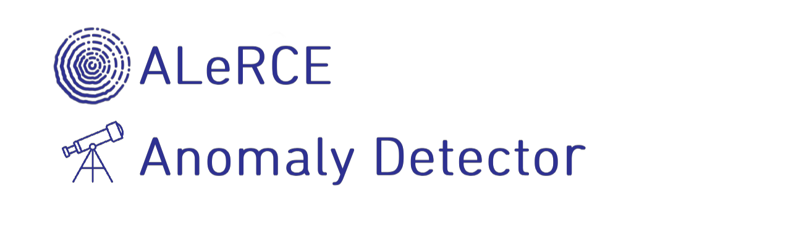
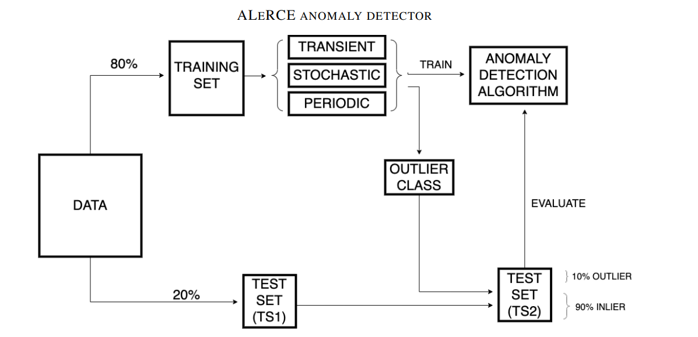

 
<p align="center">
  
</p>


## Anomaly Detector for ALeRCE broker

Welcome to the **ALeRCE anomaly detector** framework. This is the main repository where you can find all the resources associated to our article:  [Alert Classification for the ALeRCE Broker System: The Anomaly Detector](https://iopscience.iop.org/article/10.3847/1538-3881/ace0c1).

Our methodology has been published and is available through the [ALeRCE Broker](https://alerce.science/), a Chilean-led platform that processes the alert stream from the Zwicky Transient Facility (ZTF).


In our work we look for the most promising outlier detection algorithms that aim to find transient, periodic and stochastic  anomalous sources within the ZTF data stream. The **ALeRCE anomaly detector** framework consists of crossvalidating **six anomaly detection algorithms** for each of these three classes using the ALeRCE light curve features.


Following the ALeRCE taxonomy, we consider four transient subclasses, five stochastic subclasses, and five periodic subclasses. We evaluate each algorithm by considering each subclass as the anomaly class.

<h1><p></p></h1>

## About our work

We provide a Machine and Deep Learning-based framework for anomaly detection. Our methodology is inspired by the [ALeRCE's light curve (LC) classifier](https://iopscience.iop.org/article/10.3847/1538-3881/abd5c1) and follows a hierarchical approach. The light curves are categorized into three main classes: transient, stochastic, and periodic, at the top level. For each class, a distinct anomaly detection model is constructed, utilizing only information about the known objects (i.e., inliers) for training. During testing, in order to assign the light curve to one of the anomaly detectors and compute the anomaly score, we use the probabilities, as given by ALeRCE's LC classifier, indicating whether the light curve corresponds to a transient, stochastic, or periodic nature.

<details open><summary>Pipeline</summary>

<p align="center">
  
</p>

**Figure 1.** Methodology for training and evaluation of the anomaly detection algorithms. We split the data into a training set and test set composed by 80% and 20% of the data, respectively The training set is subdivided into transient stochastic, and periodic data. For each of these classes, we choose each subclass as the outlier class. The outlier class is removed from the training set and added to the test set (TS2). Then, an anomaly detection algorithm is trained using the remaining objects of each of the classes, and is evaluated using TS2.

</details>

<details open><summary>Results</summary>

See the notebooks (`/presentation/notebooks/*`) for usage examples with these models.

<table class="tg">
<thead>
  <tr>
    <th class="tg-0pky"></th>
    <th class="tg-jmd0" colspan="4">Transient</th>
    <th class="tg-jmd0" colspan="5">Stochastic</th>
    <th class="tg-jmd0" colspan="5">Periodic</th>
  </tr>
</thead>
<tbody>
  <tr>
    <td class="tg-jmd0">Method</td>
    <td class="tg-jmd0">SLSN</td>
    <td class="tg-jmd0">SNII</td>
    <td class="tg-jmd0">SNIa</td>
    <td class="tg-jmd0">SNIbc</td>
    <td class="tg-jmd0">AGN</td>
    <td class="tg-jmd0">Blazar</td>
    <td class="tg-jmd0">CV/Nova</td>
    <td class="tg-jmd0">QSO</td>
    <td class="tg-jmd0">YSO</td>
    <td class="tg-jmd0">CEP</td>
    <td class="tg-jmd0">DSCT</td>
    <td class="tg-jmd0">E</td>
    <td class="tg-jmd0">RRL</td>
    <td class="tg-jmd0">LPV</td>
  </tr>
  <tr>
    <td class="tg-yvi3">IForest</td>
    <td class="tg-yvi3">0.640<br>±0.014</td>
    <td class="tg-yvi3">0.721<br>±0.021</td>
    <td class="tg-yvi3">0.428<br>±0.032 </td>
    <td class="tg-yvi3">0.490<br>±0.038</td>
    <td class="tg-yvi3">0.573<br>±0.017</td>
    <td class="tg-yvi3">0.710<br>±0.009</td>
    <td class="tg-yvi3">0.975<br>±0.001</td>
    <td class="tg-yvi3">0.468<br>±0.016</td>
    <td class="tg-yvi3">0.913<br>±0.003</td>
    <td class="tg-yvi3">0.359<br>±0.007</td>
    <td class="tg-yvi3">0.295<br>±0.012</td>
    <td class="tg-yvi3">0.469<br>±0.021</td>
    <td class="tg-yvi3">0.549<br>±0.033</td>
    <td class="tg-yvi3">0.971<br>±0.007</td>
  </tr>
  <tr>
    <td class="tg-yvi3">OCSVM</td>
    <td class="tg-yvi3">0.577<br>±0.014</td>
    <td class="tg-yvi3">0.587<br>±0.014</td>
    <td class="tg-yvi3">0.434<br>±0.021</td>
    <td class="tg-yvi3">0.492<br>±0.011</td>
    <td class="tg-yvi3">0.532<br>±0.008</td>
    <td class="tg-yvi3">0.443<br>±0.002</td>
    <td class="tg-yvi3">0.909<br>±0.001</td>
    <td class="tg-jmd0">0.517<br>±0.005</td>
    <td class="tg-yvi3">0.792<br>±0.005</td>
    <td class="tg-yvi3">0.432<br>±0.004</td>
    <td class="tg-yvi3">0.557<br>±0.005</td>
    <td class="tg-yvi3">0.555<br>±0.003</td>
    <td class="tg-yvi3">0.539<br>±0.004</td>
    <td class="tg-yvi3">0.943<br>±0.001</td>
  </tr>
  <tr>
    <td class="tg-yvi3">AE</td>
    <td class="tg-jmd0">0.736<br>±0.022</td>
    <td class="tg-yvi3">0.807<br>±0.021</td>
    <td class="tg-yvi3">0.438<br>±0.015</td>
    <td class="tg-yvi3">0.537<br>±0.019</td>
    <td class="tg-jmd0">0.701<br>±0.010</td>
    <td class="tg-jmd0">0.762<br>±0.006</td>
    <td class="tg-jmd0">0.980<br>±0.016</td>
    <td class="tg-yvi3">0.443<br>±0.004</td>
    <td class="tg-jmd0">0.990<br>±0.001</td>
    <td class="tg-yvi3">0.564<br>±0.024</td>
    <td class="tg-yvi3">0.367<br>±0.015</td>
    <td class="tg-yvi3">0.864<br>±0.009</td>
    <td class="tg-yvi3">0.907<br>±0.015</td>
    <td class="tg-jmd0">0.996<br>±0.000</td>
  </tr>
  <tr>
    <td class="tg-yvi3">VAE</td>
    <td class="tg-yvi3">0.669<br>±0.015 </td>
    <td class="tg-yvi3">0.690<br>±0.023</td>
    <td class="tg-yvi3">0.404<br>±0.018</td>
    <td class="tg-yvi3">0.522<br>±0.025</td>
    <td class="tg-yvi3">0.596<br>±0.007</td>
    <td class="tg-yvi3">0.597<br>±0.010</td>
    <td class="tg-yvi3">0.849<br>±0.028</td>
    <td class="tg-yvi3">0.500<br>±0.009</td>
    <td class="tg-yvi3">0.795<br>±0.009</td>
    <td class="tg-yvi3">0.442<br>±0.010</td>
    <td class="tg-yvi3">0.417<br>±0.007</td>
    <td class="tg-yvi3">0.561<br>±0.007</td>
    <td class="tg-yvi3">0.451<br>±0.006</td>
    <td class="tg-yvi3">0.936<br>±0.007</td>
  </tr>
  <tr>
    <td class="tg-yvi3">Deep SVDD</td>
    <td class="tg-yvi3">0.644<br>±0.043</td>
    <td class="tg-yvi3">0.690<br>±0.043</td>
    <td class="tg-yvi3">0.475<br>±0.040</td>
    <td class="tg-yvi3">0.507<br>±0.040</td>
    <td class="tg-yvi3">0.496<br>±0.025</td>
    <td class="tg-yvi3">0.607<br>±0.044</td>
    <td class="tg-yvi3">0.932<br>±0.015</td>
    <td class="tg-yvi3">0.411<br>±0.008</td>
    <td class="tg-yvi3">0.901<br>±0.022</td>
    <td class="tg-yvi3">0.707<br>±0.027</td>
    <td class="tg-yvi3">0.482<br>±0.054</td>
    <td class="tg-yvi3">0.636<br>±0.055</td>
    <td class="tg-yvi3">0.774<br>±0.068</td>
    <td class="tg-yvi3">0.785<br>±0.025</td>
  </tr>
  <tr>
    <td class="tg-yvi3">MCDSVDD<br>(Ours)</td>
    <td class="tg-yvi3">0.686<br>±0.051</td>
    <td class="tg-jmd0">0.828<br>±0.024</td>
    <td class="tg-jmd0">0.624<br>±0.039</td>
    <td class="tg-jmd0">0.584<br>±0.032</td>
    <td class="tg-yvi3">0.706<br>±0.069</td>
    <td class="tg-yvi3">0.512<br>±0.113</td>
    <td class="tg-yvi3">0.770<br>±0.127</td>
    <td class="tg-yvi3">0.483<br>±0.080</td>
    <td class="tg-yvi3">0.854<br>±0.041</td>
    <td class="tg-jmd0">0.858<br>±0.025</td>
    <td class="tg-jmd0">0.819<br>±0.015</td>
    <td class="tg-jmd0">0.945<br>±0.006</td>
    <td class="tg-jmd0">0.953<br>±0.003</td>
    <td class="tg-yvi3">0.953<br>±0.008</td>
  </tr>
</tbody>
</table>

**Table 1.** Evaluation of the performance of each model when applied to each of the ALeRCE top level taxonomy (transient, stochastic, periodic). Each row represents a different outlier detection algorithm, and each column represents the subclass considered as outlier. The performance is evaluated using the **cross–validation AUROC scores**.

As shown in Table 1, the best performance was achieved for transient and periodic sources using a modified version of the Deep Support Vector Data Description (MCDSVDD) neural network. However, for stochastic sources, the best results were obtained by calculating the reconstruction error of an autoencoder (AE) neural network.

</details>


## Features
- Six anomaly detection algorithms were implemented in order to compare their performances in finding outliers (`/src/models/*`)
  - Isolation Forest (`/src/models/IForest.py`)
  - One-class Support Vector Machine (`/src/models/*`)
  - Autoencoder (`/src/models/Autoencoder.py`)
  - Variational Autoencoder (`/src/models/VariationalAutoencoder.py`)
  - Deep Support Vector Data Description (`/src/models/DeepSVDD.py`)
  - Multi-Class Deep SVDD (`/src/models/ClasSVDD.py`)
-  A new scheme of training and evaluation methodology
-  Validated framework in a real-world scenario by selecting the 10 sources with the highest outlier score per each of the 15 classes predicted by the ALeRCE light curve classifier (`presentation/notebooks/Results analysis.ipynb`)
- Methods trained using the ZTF alert stream and benefit from the ALeRCE LC classifier 
- Predefined experiments to reproduce publication results (`presentation/notebooks/*`)
- Data preprocessing, saving and reading (`/src/preprocessing/*`)
- Dockerfile and scripts for building (`build_container.sh`) and run (`run_container.sh`) the Anomaly Detector container


## Implementation tree
```
📦AnomalyALeRCE
 ┣ 📂data
 ┃ ┣ 📜 get_data.sh: download data (raw and preprocessed) from gdrive
 ┃ ┗ 📜 README.md: instructions how to use get_data.sh 
 ┣ 📂 experiments: experiments folder
 ┃ ┗ 📜 launch_experiments.sh: script for running all the published version of the experiments
 ┣ 📂 presentation: everything that depends on the model code (i.e., experiments, plots and figures)
 ┃ ┣ 📂 figures
 ┃ ┗ 📂 notebooks: util notebooks to visualize and analyze the results
 ┣ 📂 src: Model source code
 ┃ ┗ 📂 preprocessing: functions related to data manipulation
 ┃ ┃ ┣ 📜 ALeRCE_LC.py: data preparation functions inspired on ALeRCE LC classifier
 ┃ ┃ ┣ 📜 create_dataloaders.py: create the dataloaders for the ML and DL models
 ┃ ┃ ┣ 📜 ALeRCE_LC.py: data preparation functions inspired on ALeRCE LC classifier
 ┃ ┃ ┣ 📜 data_utils.py: general functions to standardize, among others
 ┃ ┃ ┗ 📜 main.py: main script containing functions to format data
 ┃ ┗ 📂 models: Anomaly Detector models architectures
 ┃ ┃ ┣ 📜 main.py: build the network with the selected classifier
 ┃ ┃ ┣ 📜 Autoencoder.py: Autoencoder
 ┃ ┃ ┣ 📜 ClasSVDD.py: Multi-Class Deep SVDD (ours)
 ┃ ┃ ┣ 📜 DeepSVDD.py: Deep Support Vector Data Description
 ┃ ┃ ┗ 📜 VariationalAutoencoder.py: Variational autoencoder
 ┃ ┗ 📂 utils.py: universal functions to use on different modules
 ┃ ┣ 📜 train.py: functions related to the training stage of the models
 ┃ ┗ 📜 evaluate.py: functions related to the inference stage of the models
 ┣ 📜 .gitignore: files that should not be considered during a GitHub push
 ┣ 📜 .dockerignore: files to exclude when building a Docker container.
 ┣ 📜 build_container.sh: script to build the Anomaly Detector Docker image
 ┣ 📜 run_container.sh: script to run the Anomaly Detector Docker image (up container)
 ┣ 📜 Dockerfile: Docker image definition
 ┣ 📜 requirements.txt: python dependencies
 ┣ 📜 main.py: code for running the models
 ┗ 📜 README.md: what you are currently reading
 ```

## Setup the enviroment
The easiest way to reproduce our results is to set up an environment by using [Docker](https://www.docker.com/). Docker provides the ability to package and run an application in a loosely isolated environment called a container. We create a a container identical to the one used to perform the experiments.

Install Docker by following the instructions [here](https://docs.docker.com/get-docker/).

The `Dockerfile` contains all the configurations required to run the container for the Anomaly Detector framework. You don't need to modify it directly. Instead, use the provided scripts build_container.sh and run_container.sh to handle the container setup for you.

### Building the container
To build the container, run the following command:
```
  bash build_container.sh
```

This command creates a virtual machine named `anomalydetector` that includes all the necessary dependencies, such as Python, PyTorch, and others.


### Running the Container
To run the Anomaly Detector container, use the following command:

```
  bash run_container.sh
```

This script automatically finds the `anomalydetector` container and runs it on top of your kernel. If GPUs are available, the script makes them visible inside the container.

By default, the `run_container.sh` script opens ports `8888` and `6006` for Jupyter Notebook and TensorBoard, respectively. To access them, use the following commands:

### For Jupyter Notebook 
```
jupyter notebook --ip 0.0.0.0
```
### For TensorBoard
```
tensorboard --logdir <my-logs-folder> --host 0.0.0.0
```

### Setup locally
If you prefer not to use Docker, you can install the required packages locally. The `requirements.txt` file contains all the necessary dependencies. To install them, use the following command in your local Python environment:

```
pip install -r requirements.txt
```

### Dependencies 
* Python == 3.8.10
* Torch == 2.0.1
* Other packages (see `requirements.txt` for details).

## Reproducibility
For reproducibility of our reported results run, we provide a script (`presentation/experiments/launch_experiments.bash`) that can be used to run all the models at once. It is important to note that this script includes the learning rate and embedding dimensions that were used in the paper. Additionally, the order in which the experiments are run is crucial, as the DEEPSVDD and MCDSVDD models rely on the pretrained weights of the AE model. To preprocess the data used in the paper, download the data following the next steps.  

```
src data
```

```
bash get_data.sh ztf-processed
```

### To use your own ALeRCE's ZTF data, you should first run (`src/preprocessing/main.py`). Following the steps below:

```
cd src/preprocess
```


```
python3 main.py --labels_file 'your_path1' --features_file  'your_path2' --features_list  'your_path3'
```


### Train models

If you want to train a model with your own data subsets, we provide a script (`main.py`) where you can run models as:

```
python3 main.py --model ae --hierClass Transient --outlier YSO  --all_outliers False --lr 5e-4 --z_dim 32
```
In the given case, the outlier class corresponds to the transient YSO. If you want to detect all possible outliers within the Transient hierarchical class, you should set the parameter (`--all_outliers`) to true.

```
python3 main.py --model ae --hierClass Transient --all_outliers True --lr 5e-4 --z_dim 32
```


Models (`--model`) available are Autoencoder (`ae`), Variational Autoencoder (`vae`), IForest (`iforest`), OCSVM (`ocsvm`), Deep Support Vector Data Description (`deepsvdd`) and our proposed method Multi-Class Deep SVDD (`classvdd`). Hierarchical classes (`--hierClass`) available are [`Transient`, `Stchastic`, `Periodic`].


## Contributing 🤝

Contributions are always welcome!


Issues and featuring can be directly published in this repository via [Pull Request](https://docs.github.com/en/pull-requests/collaborating-with-pull-requests/proposing-changes-to-your-work-with-pull-requests/about-pull-requests). Look at [this tutorial](https://cridonoso.github.io/articles/github.html) for more information about pull requests.


## Cite us


```
@article{Perez-Carrasco_2023,
doi = {10.3847/1538-3881/ace0c1},
url = {https://dx.doi.org/10.3847/1538-3881/ace0c1},
year = {2023},
month = {sep},
publisher = {The American Astronomical Society},
volume = {166},
number = {4},
pages = {151},
author = {Manuel Perez-Carrasco and Guillermo Cabrera-Vives and Lorena Hernandez-García and F. Förster and Paula Sanchez-Saez and Alejandra M. Muñoz Arancibia and Javier Arredondo and Nicolás Astorga and Franz E. Bauer and Amelia Bayo and M. Catelan and Raya Dastidar and P. A. Estévez and Paulina Lira and Giuliano Pignata},
title = {Alert Classification for the ALeRCE Broker System: The Anomaly Detector},
journal = {The Astronomical Journal},
abstract = {Astronomical broker systems, such as Automatic Learning for the Rapid Classification of Events (ALeRCE), are currently analyzing hundreds of thousands of alerts per night, opening up an opportunity to automatically detect anomalous unknown sources. In this work, we present the ALeRCE anomaly detector, composed of three outlier detection algorithms that aim to find transient, periodic, and stochastic anomalous sources within the Zwicky Transient Facility data stream. Our experimental framework consists of cross-validating six anomaly detection algorithms for each of these three classes using the ALeRCE light-curve features. Following the ALeRCE taxonomy, we consider four transient subclasses, five stochastic subclasses, and six periodic subclasses. We evaluate each algorithm by considering each subclass as the anomaly class. For transient and periodic sources the best performance is obtained by a modified version of the deep support vector data description neural network, while for stochastic sources the best results are obtained by calculating the reconstruction error of an autoencoder neural network. Including a visual inspection step for the 10 most promising candidates for each of the 15 ALeRCE subclasses, we detect 31 bogus candidates (i.e., those with photometry or processing issues) and seven potential astrophysical outliers that require follow-up observations for further analysis.}
      year={2023},
      eprint={2308.05011},
      archivePrefix={arXiv},
      primaryClass={cs.LG}}
```

